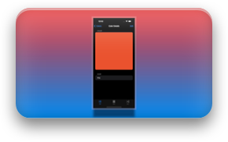

<p align="center">
    
</p>

# Colorama: Sample Project

Colorama is a sample iOS app project complimentary to my articles on the use of diffable data sources in UIKit.

This project showcases the use of diffable data sources with table and collection views alike, as well as implementation of custom views for cells with the help of `UIContentView` type.

## Articles Linked to the Project

Here are the articles for which this sample project was created:

|     |     |
| --- | --- |
|  | How to Use Diffable Data Source in UIKit |
|  | How to Use Diffable Data Source with UITableView |
|  | How to Use UIContentView in UIKit |
|  | How to Create Grid Layout in UIKit |

## UIKit VS SwiftUI

In one of my articles that link to this project I claimed that it’s super easy to create tables and collections that animate dynamic data changes in SwiftUI compared to UIKit. To prove that claim I implemented the core of the sample project in SwiftUI as well. Thus this repository is structured in the following way:

```bash
├── Colorama.xcworkspace
│   └── ColoramaUIKit.xcodeproj
│   └── ColoramaSwiftUI.xcodeproj
```

<p align="left">
    
</p>

## App Architecture

Both Colorama projects—SwiftUI and UIKit—use largely the same architecture:
- Model manages the creation and storage of the colors represented as ColorItem.
- Views are split into:
    - Table/Collection views;
    - Cell views;
    - Shared details view;
    - Shared helper views (such as, empty state).
- The entry point for both apps is the Root view.


